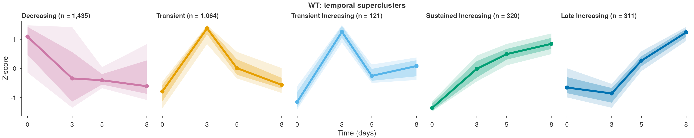

# timecourse-patterns

**Temporal clustering of omics timecourses.** Give it a counts matrix and a
samplesheet; get back the features that change over time, grouped into
trajectory classes, with publication figures and an HTML report.



*Trajectory classes that timecourse-patterns recovers from ATAC-seq of antiviral CD8+ T
cells in mice infected with LCMV Armstrong, sampled from naive (day 0) to day
8 post infection. Each panel is one class: the line is the class mean
accessibility (z-score) and the bands show its spread across peaks. Data from
McDonald, Chick et al., Immunity 2023 ([details](#demo-data)).*

## Quickstart

```bash
git clone https://github.com/bchick/timecourse-patterns
cd timecourse-patterns
pixi install
pixi run demo          # about 2 minutes, writes results/report.html
```

That runs the bundled demo, and the figure above is its actual output.

### Demo data

The demo is drawn from a published ATAC-seq timecourse of CD8+ T cells
responding to acute viral infection. Mice were infected with lymphocytic
choriomeningitis virus (LCMV) Armstrong, a strain the immune system clears
within about a week. Accessibility was profiled in naive CD8+ T cells (day 0),
in antiviral CD8+ T cells at days 3 and 5 post infection, and in sorted
terminal effector cells at day 8, the peak of the response.

It is a subset of the full samples, so that it runs in about two minutes:

- **Samples**: 9 of the study's 62 ATAC libraries: two wild-type replicates
  each at days 0, 3 and 5, and three at day 8. A 48-hour timepoint was left
  out because it failed QC.
- **Peaks**: 5,000 of the 129,076 consensus peaks on standard chromosomes,
  sampled so that every trajectory shape is represented, along with static
  and low-count peaks, so every step of the pipeline has real work to do.
- **Counts**: unchanged. Every retained peak keeps its full read count from
  each library; nothing is downsampled.

The [T cell example](#example-trajectory-classes-carry-biology) below runs the
same nine libraries on every peak.

> McDonald BD\*, Chick BY\*, Ahmed NU, et al. Canonical BAF complex activity
> shapes the enhancer landscape that licenses CD8+ T cell effector and memory
> fates. *Immunity* 56(6):1303-1319.e5 (2023).
> [doi:10.1016/j.immuni.2023.05.005](https://doi.org/10.1016/j.immuni.2023.05.005).
> GEO [GSE228381](https://www.ncbi.nlm.nih.gov/geo/query/acc.cgi?acc=GSE228381)
> (ATAC sub-series [GSE228171](https://www.ncbi.nlm.nih.gov/geo/query/acc.cgi?acc=GSE228171)).

Which libraries were used, and why, is documented in
[`demo/PROVENANCE.md`](demo/PROVENANCE.md).

## What it does

timecourse-patterns answers one question: **given counts over a timecourse, which
features change over time, and what distinct shapes do those changes take?**

It starts at a counts matrix and never touches FASTQ, BAM or peak calling, so
it composes downstream of nf-core/atacseq, nf-core/rnaseq, DiffBind,
featureCounts, salmon or any other quantifier. Features may be genomic regions
(ATAC, CUT&RUN, ChIP) or genes (RNA-seq); region-specific behaviour switches on
when you supply coordinates and is skipped silently when you do not.

The step most tools leave to you is the one it automates: turning a few dozen
correlation clusters into a handful of named, interpretable trajectory classes.

## Input

### `samplesheet.tsv`

| Column | Required | Meaning |
|---|---|---|
| `sample` | yes | Unique ID. **Must match a counts column name exactly.** |
| `group` | yes | Treatment arm, for example `DrugA` or `DrugB`. The sentinel value (default `shared`) joins that row to every arm. |
| `time` | yes | Numeric timepoint. Units are declared in the config, never parsed from the value. |
| `replicate` | yes | Replicate label within group and time. |
| `batch` | no | Used only when `batch_correct` is enabled. |
| anything else | no | Carried through to `colData` and available to custom designs. |

The `shared` sentinel is how you express a **multi-arm timecourse with one
unstimulated baseline**: the same t=0 libraries serve as the zero timepoint in
every arm, and each arm is fitted separately against them.

```
sample              group   time  replicate
vehicle_r1          shared  0     r1
vehicle_r2          shared  0     r2
drugA_2h_r1         DrugA   2     r1
drugB_2h_r1         DrugB   2     r1
```

### Counts

A `.tsv`, `.csv`, `.rds` matrix or a serialized `SummarizedExperiment`. Rows are
features, columns are samples, raw integer counts by default. A mismatch
between samplesheet IDs and counts columns is a hard error listing both sides,
never a silent subset.

### `features.bed` (optional)

BED3 or BED6 mapping to the counts row names. Supplying it switches on region
mode: BED export per trajectory class, and genomic annotation if you configure
a TxDb. Without it, timecourse-patterns runs in gene mode.

## Configuration

Everything lives in `config/config.yaml`, which ships with every key present,
its default, and a comment explaining why the key exists. A JSON Schema
validates it at parse time, so a typo fails immediately rather than three rules
later. The keys you are most likely to touch:

| Key | Default | What it controls |
|---|---|---|
| `filter.min_mean_counts` | 10 | Drops features too sparse for the assay to have measured |
| `differential.method` | `lrt` | `lrt`, `wald_union`, or `none` for single-replicate designs |
| `differential.fdr` | 0.01 | Significance gate |
| `differential.min_range` | 0.5 | Effect-size gate, on the **transformed** scale. Not a fold change. |
| `cluster.method` | `degpatterns` | `degpatterns` as in the source analysis, or `kmeans` to cluster every feature without subsampling |
| `cluster.degpatterns.minc` | 50 | Minimum cluster size; `auto` scales it to your feature count |
| `cluster.max_features` | 6000 | Above this, subsample and assign the rest by correlation |
| `superclusters.method` | `shape` | How clusters become named classes |
| `superclusters.split` | `Increasing`, k=3 | Optional second stage that splits one broad class |

Ready-made presets are in `config/presets/`.

## Output

```
results/
├── qc/           validation report, library sizes, PCA, correlations
├── differential/ <arm>_results.tsv.gz  per-feature statistics and the dynamic flag
├── clusters/     <arm>_clusters.tsv    feature to cluster to trajectory class
│                 <arm>_k_diagnostics.tsv, bed/, cross_arm_crosstab.tsv
├── figures/      six panels per arm, in pdf, svg and png
├── objects/      cached intermediates, so re-running a late rule is cheap
├── report.html
└── run_manifest.json
```

`run_manifest.json` holds the fully resolved config, package versions, every
seed, `sessionInfo()` and SHA-256 checksums of the inputs. A result that cannot
be traced to its parameters is not a result.

## Example: trajectory classes carry biology

Classes are defined from counts and timepoints alone, so a fair test is
whether they also differ in things the clustering never saw. This example runs
timecourse-patterns on every peak of the timecourse behind the demo: ATAC-seq of CD8+ T
cells in LCMV Armstrong infected mice, naive through day 8 post infection
(129,076 peaks, 54,493 of them dynamic). Each class has its own genomic
context and its own motif signature compared with static peaks.


*A: the five trajectory classes, with the number of peaks in each. B: where
each class sits in the genome, with static peaks as the reference; the dashed
line marks the promoter fraction of static peaks. C: known motifs (JASPAR2024)
enriched in each class over static peaks, by MEME-suite SEA; a dot marks
q < 1e-5.*

Peaks that close after activation (Decreasing) carry motifs of TCF7 and LEF1,
factors of the naive and memory T cell state. Peaks that open transiently,
around day 3, carry motifs of the AP-1 and BATF factors induced by T cell
activation. Peaks that open late carry motifs of ETS factors. The clustering
was never told any of this.

Scripts, tables and full reproduction steps are in
[`examples/tcell_motifs/`](examples/tcell_motifs/README.md).

## How this differs from other tools

**DiffBind** and **DESeq2** tell you *whether* a feature changed between
conditions. timecourse-patterns starts from that question already answered and asks what
*shape* the change has across the whole timecourse. It uses DESeq2 internally
for exactly that first step.

**Mfuzz** does soft clustering of expression timecourses and is a good tool. It
gives you numbered clusters and leaves both the choice of *c* and the
interpretation of each cluster to you. The workflow's contribution is the layer
above: collapsing clusters into a small number of named classes by a stated
rule, with the diagnostics to check the rule.

**ImpulseDE2** and **maSigPro** fit parametric models of expression over time,
impulse and polynomial respectively. They are more powerful than timecourse-patterns when
your trajectories really do follow that functional form, and they answer a
different question: model fit and significance rather than shape taxonomy. If
you want to know "is this gene transiently induced", they are the better tool.
If you want to know "how many distinct temporal programs are in this dataset,
and which features belong to each", timecourse-patterns is aimed at that.

**Tempora** and other trajectory-inference methods order *cells* along a
pseudotime. timecourse-patterns works on bulk timecourses with real sampled timepoints
and does not infer an ordering; you tell it the times.

What timecourse-patterns adds that none of the above provides directly: the shared
baseline across arms, the second effect-size gate, automated naming of
trajectory classes, and a reproducibility record.

## Documentation

- [`docs/method.md`](docs/method.md) why the method is what it is
- [`docs/parameters.md`](docs/parameters.md) how to choose the thresholds
- [`docs/troubleshooting.md`](docs/troubleshooting.md) symptoms and fixes
- [`docs/faq.md`](docs/faq.md)
- [`vignettes/getting-started.Rmd`](vignettes/getting-started.Rmd)

## Installation

pixi is the primary route and installs Snakemake itself, so nothing needs to be
on your PATH first:

```bash
pixi install && pixi run demo
```

Two other routes to the same pinned stack: `snakemake --use-conda` picks up
`workflow/envs/r.yaml` if you already run conda, and the container published to
GHCR carries the whole environment. `pixi.lock` is committed and pins every
package to an exact build for linux-64 and osx-arm64.

## Testing

```bash
bash tests/test_static.sh        # tier 1, seconds, no execution
bash tests/test_endtoend.sh      # tier 2, minutes, full run on the demo
Rscript tests/test_correctness.R # tier 3, recovery of known trajectory shapes
```

Tier 3 simulates counts from five known shapes and checks what comes back.

## Citation

To cite timecourse-patterns itself, see [`CITATION.cff`](CITATION.cff).

If you use the bundled demo data or the T cell example, cite the paper the
data come from, not this repository:

> McDonald BD\*, Chick BY\*, Ahmed NU, et al. Canonical BAF complex activity
> shapes the enhancer landscape that licenses CD8+ T cell effector and memory
> fates. *Immunity* 56(6):1303-1319.e5 (2023).
> [doi:10.1016/j.immuni.2023.05.005](https://doi.org/10.1016/j.immuni.2023.05.005)

\* Equal contribution.

## License

MIT. See [`LICENSE`](LICENSE).
