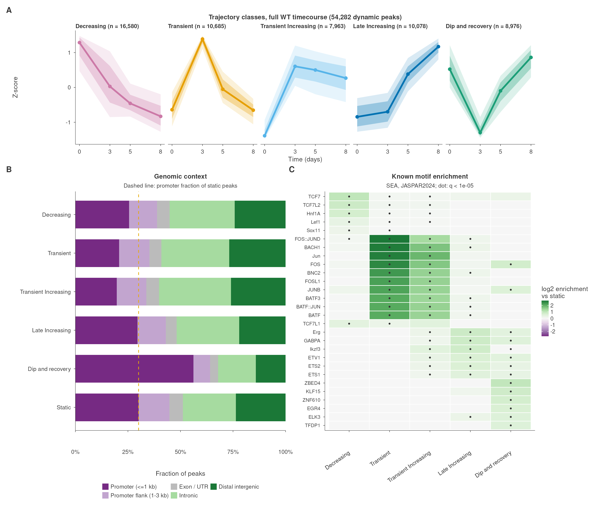

# Example: are trajectory classes biology?

chromadyn defines trajectory classes from counts and timepoints alone. This
example asks whether those classes also differ in things the clustering never
saw: where in the genome they sit, and which transcription factor motifs they
carry. If they do, the classes reflect regulatory programs rather than an
artefact of the clustering.



*CD8+ T cell ATAC-seq after LCMV Armstrong infection, days 0 to 8 post
infection. **A**: the five trajectory classes, covering 54,282 dynamic peaks. The line is the class mean accessibility (z-score); the bands
show its spread across peaks. **B**: genomic context of each class, with
static peaks as the reference; the dashed line marks the promoter fraction of
static peaks. **C**: known motifs enriched in each class over static peaks
(MEME-suite SEA, JASPAR2024). Colour is log2 enrichment and a dot marks
q < 1e-5. The top six motifs per class are shown.*

## Data

ATAC-seq of wild-type CD8+ T cells responding to acute viral infection. Mice
were infected with lymphocytic choriomeningitis virus (LCMV) Armstrong, which
is cleared within about a week. Chromatin accessibility was profiled in naive
CD8+ T cells (day 0), in antiviral CD8+ T cells at days 3 and 5 post
infection, and in sorted terminal effector cells at day 8, the peak of the
response. The timecourse therefore spans activation, clonal expansion and
effector differentiation.

> McDonald BD\*, Chick BY\*, Ahmed NU, et al. Canonical BAF complex activity
> shapes the enhancer landscape that licenses CD8+ T cell effector and memory
> fates. *Immunity* 56(6):1303-1319.e5 (2023).
> [doi:10.1016/j.immuni.2023.05.005](https://doi.org/10.1016/j.immuni.2023.05.005).
> GEO [GSE228381](https://www.ncbi.nlm.nih.gov/geo/query/acc.cgi?acc=GSE228381)
> (ATAC sub-series [GSE228171](https://www.ncbi.nlm.nih.gov/geo/query/acc.cgi?acc=GSE228171)).
> \* Equal contribution.

Cite that paper, not this repository, when you use these data.

This is the same timecourse as the bundled demo, with the same nine libraries
and design (see [`demo/PROVENANCE.md`](../../demo/PROVENANCE.md)). The
difference is that it uses every consensus peak on a standard chromosome
(129,076) instead of a 5,000-peak subsample. chromadyn runs with the demo
settings unchanged, so any difference from the demo comes from the data.

Of the 73,528 peaks that pass the count prefilter, it calls 54,493 dynamic
and 19,035 static. Of the dynamic peaks, 54,282 fall into the five classes
below and 211 are left unassigned. The `Increasing` class is
split in three, and the split names its pieces numerically. They are renamed
here by the shape they actually have:

| chromadyn label | Shape | Peaks |
|---|---|---|
| Decreasing | Decreasing | 16,580 |
| Transient | Transient | 10,685 |
| Increasing-1 | Transient Increasing: rises by day 3, then slowly declines | 7,963 |
| Increasing-2 | Late Increasing: flat to day 3, then rises | 10,078 |
| Increasing-3 | Dip and recovery: falls at day 3, recovers above baseline | 8,976 |

## Method

Static peaks (accessible regions the same run judged not to change) are the
reference throughout. Against shuffled or genomic sequence, every class would
look enriched for the motifs of whatever keeps chromatin open. Against static
peaks, enrichment means the motif is specific to that temporal program.

- **Genomic context** (`annotate_classes.R`): ChIPseeker against GENCODE
  vM35, collapsed to five categories: promoter (within 1 kb of a TSS),
  promoter flank (1 to 3 kb), exon/UTR, intronic and distal intergenic. No
  category is called "enhancer"; that would need histone marks or perturbation
  data this analysis does not use.
- **Motifs** (`run_motifs.sh`): MEME-suite SEA 5.5.4 per class against 20,000
  static peaks sampled with a fixed seed. Every region is trimmed to 200 bp
  around the peak centre, so differences in peak width between classes cannot
  pass for enrichment. Motifs are JASPAR2024 CORE vertebrates non-redundant
  (879 motifs):

  ```bash
  curl -L --create-dirs -o examples/tcell_motifs/work/motifs/jaspar2024_vert_nr.meme \
    https://jaspar.elixir.no/download/data/2024/CORE/JASPAR2024_CORE_vertebrates_non-redundant_pfms_meme.txt
  # sha256 dd494278d356a4e170908c74d6d8eb746a2c7504d6210cd51017141f21a65b18
  ```

## Results

- **Decreasing**: TCF7, LEF1, TCF7L2 and HNF1A motifs, the TCF/LEF family
  associated with the naive and memory T cell state, which is closing as the
  cells activate.
- **Transient** and **Transient Increasing**: dominated by AP-1 and BATF
  (FOS, JUN, JUNB, FOSL1, BATF, BATF3, BACH1), the activation-induced factors,
  with enrichment ratios above 4 in the Transient class. Both classes are
  depleted of promoters relative to static peaks, which fits distal elements
  opened by activation.
- **Late Increasing**: ETS factors (ETS1, ETS2, ERG, GABPA, ETV1) and IKZF3.
- **Dip and recovery**: 56% promoter peaks, against 30% of static peaks. Its
  top motifs (KLF15, ZBED4, ZNF610, EGR4, TFDP1) are GC-rich, which may reflect
  the base composition of CpG-island promoters as much as specific factor
  binding. Treat these hits with that caveat in mind.

Full tables: [`motif_enrichment.tsv`](motif_enrichment.tsv) (every SEA result
per class) and [`genomic_annotation.tsv`](genomic_annotation.tsv).

## Reproducing

Run everything from the repository root. Beyond the chromadyn environment, the
example needs bedtools, samtools, the MEME suite, and the Bioconductor
packages ChIPseeker and txdbmaker.

Every script takes its input paths as arguments. With no arguments, each one
reads from these default locations, all of them relative and git-ignored:

| File | Default location | Source |
|---|---|---|
| featureCounts matrix | `demo/_source_featureCounts.txt` | nf-core/atacseq consensus peaks from GSE228171; see [`demo/PROVENANCE.md`](../../demo/PROVENANCE.md) |
| GRCm39 genome FASTA and its `.fai` | `examples/tcell_motifs/work/reference/GRCm39.primary_assembly.genome.fa` | [GENCODE M35](https://ftp.ebi.ac.uk/pub/databases/gencode/Gencode_mouse/release_M35/GRCm39.primary_assembly.genome.fa.gz) |
| GENCODE vM35 GTF | `examples/tcell_motifs/work/reference/gencode.vM35.primary_assembly.annotation.gtf` | [GENCODE M35](https://ftp.ebi.ac.uk/pub/databases/gencode/Gencode_mouse/release_M35/gencode.vM35.primary_assembly.annotation.gtf.gz) |
| JASPAR motifs | `examples/tcell_motifs/work/motifs/jaspar2024_vert_nr.meme` | the `curl` command under Method |

```bash
# reference files
mkdir -p examples/tcell_motifs/work/reference && cd examples/tcell_motifs/work/reference
G=https://ftp.ebi.ac.uk/pub/databases/gencode/Gencode_mouse/release_M35
curl -L $G/GRCm39.primary_assembly.genome.fa.gz | gunzip > GRCm39.primary_assembly.genome.fa
curl -L $G/gencode.vM35.primary_assembly.annotation.gtf.gz | gunzip > gencode.vM35.primary_assembly.annotation.gtf
samtools faidx GRCm39.primary_assembly.genome.fa
cd -

# the analysis
Rscript examples/tcell_motifs/build_inputs.R
pixi run --frozen snakemake -j 8 \
    --configfile config/demo.yaml examples/tcell_motifs/config.yaml
bash examples/tcell_motifs/run_motifs.sh
Rscript examples/tcell_motifs/annotate_classes.R
pixi run --frozen Rscript examples/tcell_motifs/plot_motifs.R
pixi run --frozen Rscript examples/tcell_motifs/make_figure.R
```

Pass both config files after a single `--configfile` flag. Repeating the flag
replaces the first file instead of stacking on it.

Intermediates go to `work/` (about 2.5 GB, not committed).
